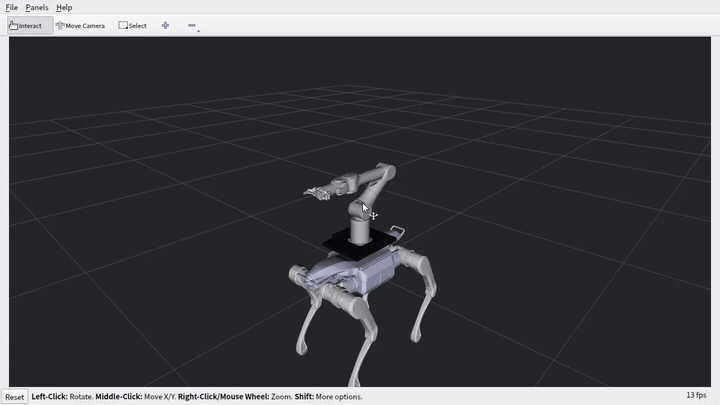
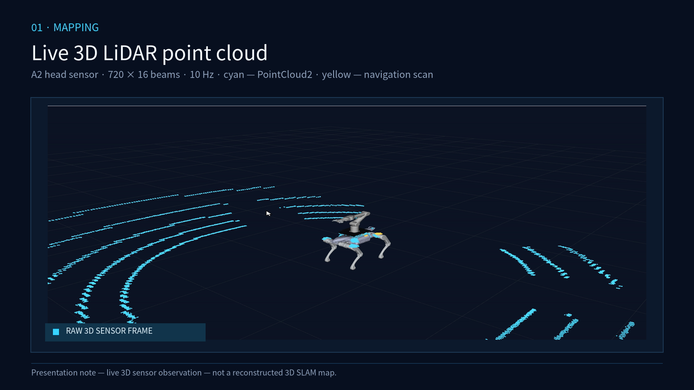
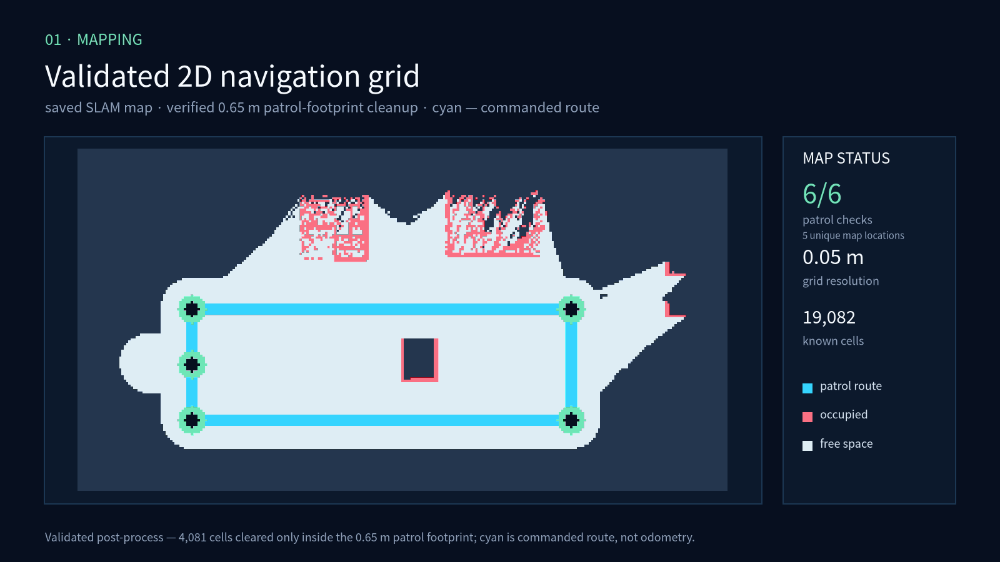
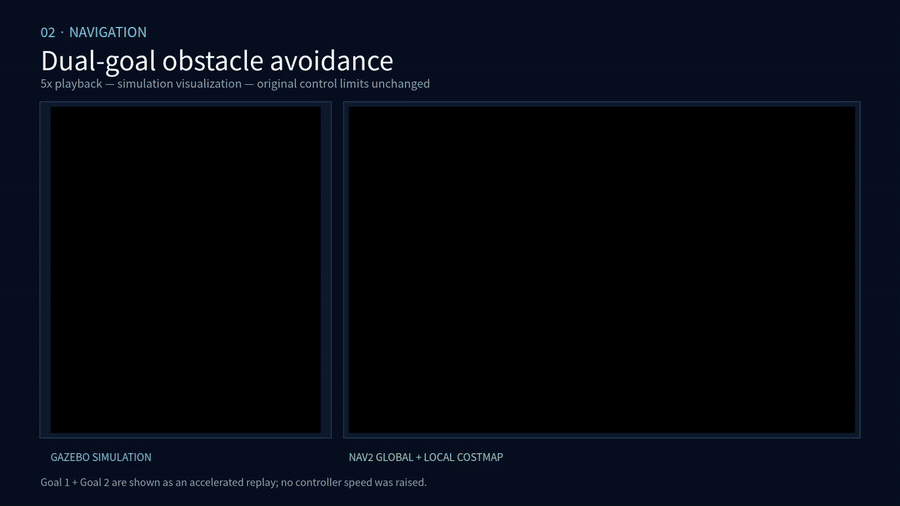
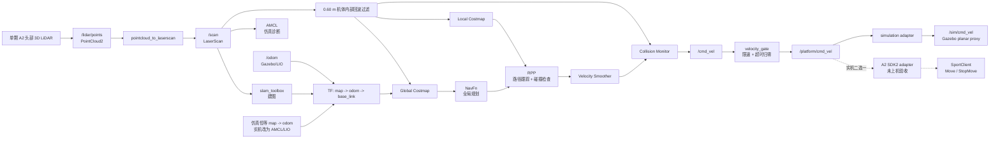
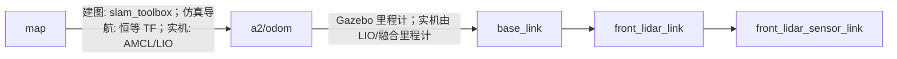
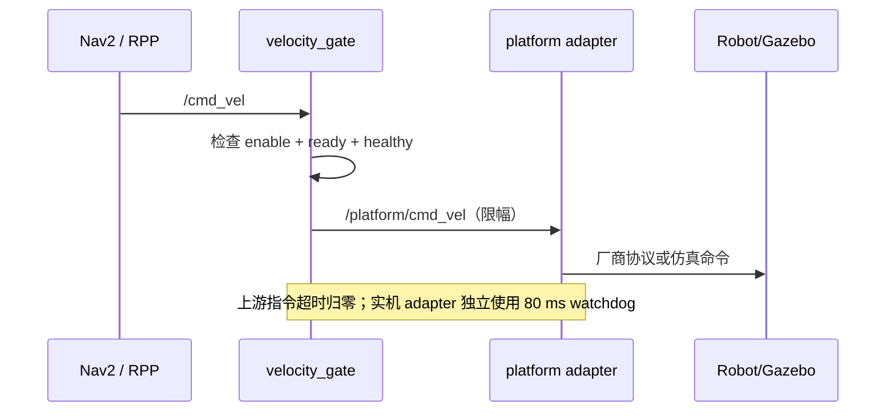

# ATEC A2 + P7 | ROS 2 Nav2 Gazebo Navigation

> **ATEC 2026 导航仿真与验证仓库**
>
> 用一颗 A2 头部 3D 雷达，在 Gazebo 中复现 **点云投影、SLAM 建图、Nav2 规划、RPP 路径跟踪和安全速度门**的完整闭环。

<p align="center">
  
  
  
  
</p>

## 演示：仿真 → 建图 → 导航

### 01 · 仿真｜A2 + P7 模型

<p align="center">
  <a href="docs/media/atec_a2_p7_robot_showcase.mp4">
    
  </a>
</p>

### 02 · 建图｜3D LiDAR → 2D 栅格

<p align="center">
  
</p>

<p align="center">
  
</p>

上图为实时 3D LiDAR 点云和最终 2D 导航栅格（保存 SLAM 图后经 `0.65 m` 巡航 footprint 清理）。建图巡航 `6/6`，分辨率 `0.05 m/cell`；[展示媒体清单](docs/evidence/github_showcase_media_manifest.json)保留输入、声明和 SHA-256。

### 03 · 导航｜双目标绕障

<p align="center">
  <a href="docs/media/atec_a2_p7_navigation_showcase.mp4">
    
  </a>
</p>

<p align="center">
  <a href="docs/media/atec_a2_p7_navigation_showcase.mp4">播放 5× 导航演示（约 17.3 秒）</a>
</p>

## 项目简介

本仓库复现 A2 + P7 的单雷达 SLAM 与 Nav2 闭环：传感器接入导航计算机，Nav2 通过独立 adapter 输出安全速度。当前 Gazebo 使用平面代理验证软件链路；A2 SDK2 实机 adapter 已接入，但尚未在实体 A2 上验收。活动控制器为 Regulated Pure Pursuit。

## 你可以展示什么

| 展示主题 | 仓库中的实现 | 汇报时的结论 |
| --- | --- | --- |
| 单雷达导航 | `/lidar/points -> /scan -> /collision_scan` | 一颗 3D 雷达同时服务 SLAM、AMCL 诊断、局部/全局障碍层和急停预测 |
| 建图与仿真定位 | `slam_toolbox` + Gazebo 无漂移里程计 | 建图、保存地图、重启后导航是两个明确阶段；AMCL 保留为诊断，不冒充实机定位 |
| 全局与局部规划 | `NavFn` + `RegulatedPurePursuitController` | 全局路径负责绕行，RPP 负责确定性跟踪、转向和前向碰撞检查 |
| 安全控制 | `velocity_gate.py` | Nav2 不直连底盘，enable/ready/healthy 任一失效即归零 |
| A2 官方接口 | `a2_hardware_control.launch.py` + `atec_a2_sdk2_adapter` | 官方控制边界已接入；已通过无 SDK 测试，未完成实机验收 |
| 可重复验收 | `run_atec_end_to_end_demo.sh` | 自动巡航、保存地图、导航目标和 JSON 工件全部可审计 |

## 已验证导航结果

`inflation_radius=0.70 m`、`robot_radius=0.60 m`；建图巡航 `6/6`，两个导航目标均为 `SUCCEEDED`，终点误差 `0.2406 m / 0.2395 m`。详见[导航验证证据](docs/NAVIGATION_EVIDENCE.md)。

## 系统总览



### TF 责任边界



同一时刻只能有一个节点发布 `map -> a2/odom`。建图阶段使用 slam_toolbox；当前导航演示的地图直接建立在 Gazebo 无漂移里程计坐标中，因此使用仿真专用恒等 TF，AMCL 只输出诊断位姿。实机必须移除该静态 TF，并由经验证的 AMCL/LIO 定位源发布；平台 adapter 不得发布定位 TF。

## 关键设计

### 一颗雷达，两种数据表示

`/lidar/points` 是单颗 A2 头部 3D 雷达的原始点云。`/scan` 是从这颗雷达投影出的二维扫描，用于 slam_toolbox 和 AMCL；投影高度带为 `-0.50 ~ 0.12 m`，最小量程保持 `0.40 m`。局部与全局代价地图以及碰撞监控共同使用 `/collision_scan`：每个 `/scan` 端点先按 A2 雷达前移 `0.33767 m` 换算到 `base_link`，再移除 `0.60 m` 仿真机体足迹内部的 A2/P7 自回波。这样所有导航感知仍来自同一颗 3D 雷达，同时避免原始点云中的机体回波将滚动局部代价地图封死；足迹外的平地障碍仍参与规划和急停预测。

### Nav2 不直接控制机器人



`velocity_gate` 的默认仿真限速为 `0.15 m/s` 和 `0.25 rad/s`。`atec_a2_sdk2_adapter` 再独立限制到 `0.10 m/s` 和 `0.20 rad/s`，固定使用 Unitree 官方 `unitree_sdk2_python` 提交 `65691c8a8bc53b98d3976dba4dbf9d5d20b2e7f5`，并且只调用 A2 `SportClient.Move(vx, 0.0, vyaw)` 与 `StopMove()`。

实机 adapter 要求 `/platform/automatic_mode`、`/platform/manual_override` 和 `/platform/estop` 的权威心跳，同时检查 `rt/lf/sportmodestate`。RPC、非法命令、手柄抢占、急停或 Sport 状态故障会锁存，需要 `automatic_mode=false -> true` 且重新收到命令才能恢复。官方公开 SDK 未提供可直接代替这三个安全信号的 A2 接口，因此必须由另行验收的硬件或 PLC bridge 提供。服务已匹配时的名义停止请求路径为 `0.14 s`；SDK writer 未匹配时的本地返回路径约为 `0.30 s`，且无法送达停止请求。因此必须另配机器人侧 watchdog 和实体急停，当前不声称达成 200 ms 实机停止上界。`simulation_platform_adapter.py` 和 Gazebo `VelocityControl` 只能用于仿真回归。

硬件控制路径使用 DDS 本地接收时间拒绝排队旧命令，权威心跳或 Sport 状态在曾经就绪后超时会锁存；速度、超时和模式 3/4 是代码硬上限，YAML 只能进一步收紧。SDK 启动时还会核对 pip 的 PEP 610 元数据，安装来源或提交不匹配即保持 fail-closed。精确边界和安装限制见 [A2 官方 SDK2 adapter](src/atec_a2_sdk2_adapter/README.md)。

## 目录结构

```text
ros2-nav2-mppi-gazebo-repro/
├── src/atec_a2_sdk2_adapter/      # 官方 A2 SDK2 实机边界（未上机验收）
├── src/independent_nav_bringup/
│   ├── launch/                 # mapping.launch.py / navigation.launch.py
│   ├── config/                 # SLAM、AMCL、Nav2、RPP 参数
│   ├── scripts/                # gate、health、任务编排、仿真 adapter
│   ├── platforms/              # A2 + P7 / X30 平台契约
│   └── rviz/                   # 建图与导航 RViz 配置
├── 建模/sim_src/                # A2 + P7 URDF、网格、雷达、练习场
├── maps/                       # 保存后的 PGM/YAML 地图
├── docs/END_TO_END_DEMO.md     # 自动闭环与录屏验收
├── run_mapping.sh              # 启动建图
├── run_navigation.sh           # 启动定位与导航
└── run_atec_end_to_end_demo.sh # 一键回归演示
```

## 支持环境

| 项目 | 要求 |
| --- | --- |
| 操作系统 | Ubuntu 24.04 LTS（推荐原生安装） |
| ROS 2 | Jazzy Jalisco |
| 仿真器 | Gazebo Harmonic / Gazebo Sim 8 |
| 导航 | Nav2、NavFn、Regulated Pure Pursuit Controller、SLAM Toolbox |
| 构建工具 | `colcon`、CMake、Python 3 |
| A2 实机可选依赖 | 固定提交的 Unitree `unitree_sdk2_python`，不影响无 SDK 构建和单测 |

官方 SDK 固定的 `cyclonedds==0.10.2` 没有 CPython 3.12 Linux wheel；Ubuntu 24.04/Jazzy 目标必须预先构建兼容的原生 CycloneDDS 和明确的 ROS Python 环境，不能依赖裸 `python3 -m pip`。

仓库按 ROS 2 Jazzy 的 Debian 软件包进行安装和验证。其他 Ubuntu/ROS 版本需要自行调整软件包名称和依赖，不属于当前复现基线。

## 快速开始

### 1. 克隆仓库

```bash
git clone https://github.com/hezhou0331/ros2-nav2-mppi-gazebo-repro.git
cd ros2-nav2-mppi-gazebo-repro
```

后续命令均在仓库根目录执行，不依赖固定用户名或安装路径。

### 2. 安装依赖

先按照 [ROS 2 Jazzy Ubuntu 安装文档](https://docs.ros.org/en/jazzy/Installation/Ubuntu-Install-Debs.html) 配置 ROS 2 软件源，然后执行：

```bash
./install_dependencies.sh
```

该脚本安装 ROS 2 Desktop、Nav2、Regulated Pure Pursuit Controller、SLAM Toolbox、`ros_gz`、机器人状态发布和 Xacro 等仿真运行依赖。A2 实机 SDK 只应在目标 Orin 上按 [adapter 文档](src/atec_a2_sdk2_adapter/README.md) 安装固定提交。

### 3. 构建并验证

```bash
./build_atec_a2_p7_nav.sh
./validate_atec_a2_p7_nav.sh
```

构建脚本会自动定位仓库根目录，因此仓库可以放在任意用户目录。验证脚本检查包结构、模型、TF、启动配置和导航参数。

官方 A2 控制边界单独启动，不会混入 Gazebo、仿真恒等 TF 或伪安全发布者：

```bash
ros2 launch independent_nav_bringup a2_hardware_control.launch.py \
  network_interface:=enp2s0
```

该 launch 仍要求外部提供经验证的 `/cmd_vel`、`/nav/healthy` 和三路权威安全心跳，不是完整实机导航 bringup。

### 4. 启动建图

```bash
./run_mapping.sh use_gui:=true
```

在仿真中完成一圈巡航后保存地图：

```bash
source /opt/ros/jazzy/setup.bash
source install/setup.bash
ros2 run independent_nav_bringup save_map.py \
  --output "$PWD/maps/atec_practice_world"
```

### 5. 启动定位诊断 + Nav2

```bash
./run_navigation.sh \
  "$PWD/maps/atec_practice_world.yaml" \
  use_gui:=true
```

当前 Gazebo 演示使用无漂移里程计和仿真专用恒等 `map -> a2/odom`，无需在 RViz 初始化 AMCL；直接使用 `Nav2 Goal` 发送目标。AMCL 仍运行并输出诊断位姿，但不广播 TF。默认出生点为 `(-5.8, 0, 0)`。

### 6. 一键闭环演示

```bash
./run_atec_end_to_end_demo.sh
```

脚本自动完成：


工件写入 `artifacts/atec_demo_<UTC时间戳>_<PID>/`，重点查看：

- `run_report.json`：总流程、失败阶段、ROS/Gazebo 隔离信息
- `map_validation.json`：地图尺寸、已知像素、占用像素
- `mapping_patrol.json`：巡航航点和到点误差
- `navigation_mission.json`：目标状态和最终位姿误差
- `demo_report.json`：完整闭环验收结论

## 实机边界

本仓库验证的是导航软件闭环，不是 A2 的真实运动学。以下内容进入实机前必须重新完成：

- `base_link -> lidar` 实测外参和时间同步
- 用 URDF/3D 几何自过滤替换仿真的 `0.60 m` 整足迹过滤；后者可能删除已经
  进入安全足迹的真实动态障碍，禁止直接用于实机 Collision Monitor
- LIO/融合里程计及 `odom -> base_link`
- 已实现的 A2 官方 SDK2 速度 adapter 必须在支撑架和实体机器人上验证
- 为自动模式、手柄抢占和实体急停接入独立的权威安全心跳
- 将仿真 `2.0 s` 传感健康窗口收紧为经实测批准的上限，并用
  机器人侧 watchdog、实体急停和通信丢失策略验收停止时限
- P7 安装板载荷、重心、footprint 和限速
- 扫描匹配、回环检测、AMCL 噪声参数和地图质量

因此，本仓库适合仿真、录包、离线回放、规划验证和汇报演示；在完成平台 adapter 与 G1-G6 验收前，不得连接实体 A2。

## 进一步阅读

- [导航验证证据](docs/NAVIGATION_EVIDENCE.md)
- [地形代理评估与能力边界](docs/TERRAIN_ASSESSMENT.md)
- [自动闭环与录屏验收](docs/END_TO_END_DEMO.md)
- [平台 adapter 契约](src/independent_nav_bringup/docs/PLATFORM_ADAPTER_CONTRACT.md)
- [A2 官方 SDK2 adapter](src/atec_a2_sdk2_adapter/README.md)
- [A2 运动后端与非滑行仿真阻塞](docs/A2_MOTION_BACKEND_STATUS.md)
- [A2/P7 模型与安全边界](建模/sim_src/src/atec_a2_p7_description/docs/MODEL_AND_SAFETY.md)
- [模型来源与许可证](建模/sim_src/src/atec_a2_p7_description/docs/MODEL_PROVENANCE.md)

## License

详见 [LICENSE](LICENSE) 与 [NOTICE](NOTICE)。
