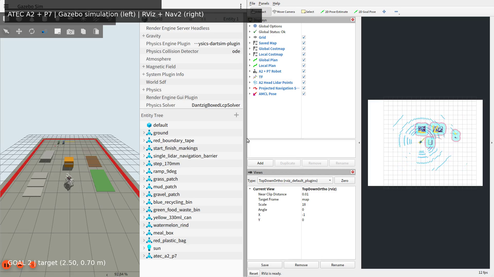
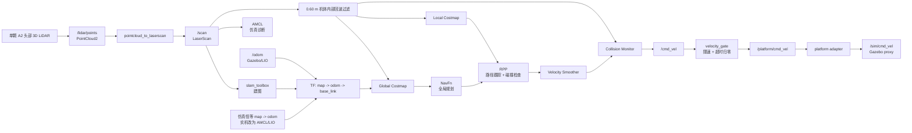
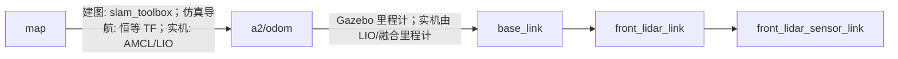
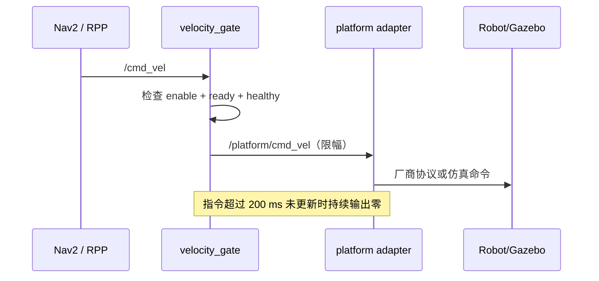

# ATEC A2 + P7 | ROS 2 Nav2 Gazebo Navigation

> **ATEC 2026 导航仿真与验证仓库**
>
> 用一颗 A2 头部 3D 雷达，在 Gazebo 中复现 **点云投影、SLAM 建图、Nav2 规划、RPP 路径跟踪和安全速度门**的完整闭环。

<p align="center">
  
  
  
  
</p>

## 一句话介绍

这是一个面向汇报和回归测试的导航系统复现工程：**传感器只接入导航计算机，Nav2 只输出安全速度，平台控制通过独立 adapter 隔离**。当前 Gazebo 运动部分是平面代理，用于验证导航软件链路，不代表真实 A2 步态控制器。

GitHub 仓库沿用早期包含 `mppi` 的 URL；当前经过实体障碍回归验证的活动控制器是
Regulated Pure Pursuit，活动参数文件为
`src/independent_nav_bringup/config/nav2_atec_a2_p7.yaml`。

## 你可以展示什么

| 展示主题 | 仓库中的实现 | 汇报时的结论 |
| --- | --- | --- |
| 单雷达导航 | `/lidar/points -> /scan -> /collision_scan` | 一颗 3D 雷达同时服务 SLAM、AMCL 诊断、局部/全局障碍层和急停预测 |
| 建图与仿真定位 | `slam_toolbox` + Gazebo 无漂移里程计 | 建图、保存地图、重启后导航是两个明确阶段；AMCL 保留为诊断，不冒充实机定位 |
| 全局与局部规划 | `NavFn` + `RegulatedPurePursuitController` | 全局路径负责绕行，RPP 负责确定性跟踪、转向和前向碰撞检查 |
| 安全控制 | `velocity_gate.py` | Nav2 不直连底盘，enable/ready/healthy 任一失效即归零 |
| 可重复验收 | `run_atec_end_to_end_demo.sh` | 自动巡航、保存地图、导航目标和 JSON 工件全部可审计 |

## 已验证导航结果

2026-07-26 的实体障碍回归中，两个 `NavigateToPose` 目标均返回 `SUCCEEDED`，终点误差分别为 0.2361 m 和 0.2347 m，累计轨迹为 8.9854 m。五级速度命令链均观测到非零输出；运行时实际控制器为 RPP，原工件目录名中的 `mppi` 只是历史命名。详细指标、原始 JSON 和仿真边界见 [导航验证证据](docs/NAVIGATION_EVIDENCE.md)。

## 演示视频

### 单雷达建图与双目标绕障导航

<p align="center">
  <a href="docs/media/atec_a2_p7_navigation_highlight.mp4">
    
  </a>
</p>

<p align="center">
  <a href="docs/media/atec_a2_p7_navigation_highlight.mp4">85.76 秒导航精华</a>
  ·
  <a href="docs/media/atec_a2_p7_end_to_end_demo.mp4">346.88 秒建图到导航完整闭环</a>
</p>

左侧为 Gazebo 中的 A2 + P7 和实体障碍，右侧为 RViz 中的已保存地图、单雷达投影、全局/局部代价地图与规划路径。本次录屏的建图巡航 `6/6` 通过，两个导航目标均为 `SUCCEEDED`，终点误差为 0.2373 m 和 0.2329 m。视频通过 1920 x 1080、25 fps、H.264 编码及左右画面非空校验。

### A2 + P7 仿真模型

<p align="center">
  <video controls width="720" src="https://cdn.jsdelivr.net/gh/hezhou0331/ros2-nav2-mppi-gazebo-repro@main/docs/media/atec_a2_p7_robot_showcase.mp4">
    A2 + P7 仿真模型视频
  </video>
</p>

<p align="center">
  GitHub 页面内直接播放；<a href="docs/media/atec_a2_p7_robot_showcase.gif">GIF 预览</a> · <a href="docs/media/atec_a2_p7_robot_showcase.mp4">下载完整 MP4</a>
</p>

该视频展示仓库中实际使用的 Unitree A2、背载 P7 机械臂与 UMI 夹爪组合模型。README 使用精简 GIF 自动预览，完整视频保留原始分辨率。

## 系统总览



### TF 责任边界



同一时刻只能有一个节点发布 `map -> a2/odom`。建图阶段使用 slam_toolbox；当前导航演示的地图直接建立在 Gazebo 无漂移里程计坐标中，因此使用仿真专用恒等 TF，AMCL 只输出诊断位姿。实机必须移除该静态 TF，并由经验证的 AMCL/LIO 定位源发布；平台 adapter 不得发布定位 TF。

## 关键设计

### 一颗雷达，两种数据表示

`/lidar/points` 是单颗 A2 头部 3D 雷达的原始点云。`/scan` 是从这颗雷达投影出的二维扫描，用于 slam_toolbox 和 AMCL；投影高度带为 `-0.50 ~ 0.12 m`，最小量程保持 `0.40 m`。局部与全局代价地图以及碰撞监控共同使用 `/collision_scan`：每个 `/scan` 端点先按 A2 雷达前移 `0.33767 m` 换算到 `base_link`，再移除 `0.60 m` 仿真机体足迹内部的 A2/P7 自回波。这样所有导航感知仍来自同一颗 3D 雷达，同时避免原始点云中的机体回波将滚动局部代价地图封死；足迹外的平地障碍仍参与规划和急停预测。

### Nav2 不直接控制机器人



`velocity_gate` 的默认仿真限速为 `0.15 m/s` 和 `0.25 rad/s`。这套边界可复用到实机，但 `simulation_platform_adapter.py` 和 Gazebo `VelocityControl` 不能用于真实 A2。

## 目录结构

```text
ros2-nav2-mppi-gazebo-repro/
├── src/independent_nav_bringup/
│   ├── launch/                 # mapping.launch.py / navigation.launch.py
│   ├── config/                 # SLAM、AMCL、Nav2、RPP 参数
│   ├── scripts/                # gate、health、任务编排、仿真 adapter
│   ├── platforms/              # A2 + P7 / X30 平台契约
│   └── rviz/                   # 建图与导航 RViz 配置
├── 建模/sim_src/                # A2 + P7 URDF、网格、雷达、练习场
├── maps/                       # 保存后的 PGM/YAML 地图
├── docs/END_TO_END_DEMO.md     # 自动闭环与录屏验收
├── run_mapping.sh              # 启动建图
├── run_navigation.sh           # 启动定位与导航
└── run_atec_end_to_end_demo.sh # 一键回归演示
```

## 支持环境

| 项目 | 要求 |
| --- | --- |
| 操作系统 | Ubuntu 24.04 LTS（推荐原生安装） |
| ROS 2 | Jazzy Jalisco |
| 仿真器 | Gazebo Harmonic / Gazebo Sim 8 |
| 导航 | Nav2、NavFn、Regulated Pure Pursuit Controller、SLAM Toolbox |
| 构建工具 | `colcon`、CMake、Python 3 |

仓库按 ROS 2 Jazzy 的 Debian 软件包进行安装和验证。其他 Ubuntu/ROS 版本需要自行调整软件包名称和依赖，不属于当前复现基线。

## 快速开始

### 1. 克隆仓库

```bash
git clone https://github.com/hezhou0331/ros2-nav2-mppi-gazebo-repro.git
cd ros2-nav2-mppi-gazebo-repro
```

后续命令均在仓库根目录执行，不依赖固定用户名或安装路径。

### 2. 安装依赖

先按照 [ROS 2 Jazzy Ubuntu 安装文档](https://docs.ros.org/en/jazzy/Installation/Ubuntu-Install-Debs.html) 配置 ROS 2 软件源，然后执行：

```bash
./install_dependencies.sh
```

该脚本安装 ROS 2 Desktop、Nav2、Regulated Pure Pursuit Controller、SLAM Toolbox、`ros_gz`、机器人状态发布和 Xacro 等运行依赖。

### 3. 构建并验证

```bash
./build_atec_a2_p7_nav.sh
./validate_atec_a2_p7_nav.sh
```

构建脚本会自动定位仓库根目录，因此仓库可以放在任意用户目录。验证脚本检查包结构、模型、TF、启动配置和导航参数。

### 4. 启动建图

```bash
./run_mapping.sh use_gui:=true
```

在仿真中完成一圈巡航后保存地图：

```bash
source /opt/ros/jazzy/setup.bash
source install/setup.bash
ros2 run independent_nav_bringup save_map.py \
  --output "$PWD/maps/atec_practice_world"
```

### 5. 启动定位诊断 + Nav2

```bash
./run_navigation.sh \
  "$PWD/maps/atec_practice_world.yaml" \
  use_gui:=true
```

当前 Gazebo 演示使用无漂移里程计和仿真专用恒等 `map -> a2/odom`，无需在 RViz 初始化 AMCL；直接使用 `Nav2 Goal` 发送目标。AMCL 仍运行并输出诊断位姿，但不广播 TF。默认出生点为 `(-5.8, 0, 0)`。

### 6. 一键闭环演示

```bash
./run_atec_end_to_end_demo.sh
```

脚本自动完成：


工件写入 `artifacts/atec_demo_<UTC时间戳>_<PID>/`，重点查看：

- `run_report.json`：总流程、失败阶段、ROS/Gazebo 隔离信息
- `map_validation.json`：地图尺寸、已知像素、占用像素
- `mapping_patrol.json`：巡航航点和到点误差
- `navigation_mission.json`：目标状态和最终位姿误差
- `demo_report.json`：完整闭环验收结论

## 实机边界

本仓库验证的是导航软件闭环，不是 A2 的真实运动学。以下内容进入实机前必须重新完成：

- `base_link -> lidar` 实测外参和时间同步
- 用 URDF/3D 几何自过滤替换仿真的 `0.60 m` 整足迹过滤；后者可能删除已经
  进入安全足迹的真实动态障碍，禁止直接用于实机 Collision Monitor
- LIO/融合里程计及 `odom -> base_link`
- A2 官方连续速度接口、自动模式和手柄抢占
- 将仿真 `2.0 s` 传感健康窗口收紧为经实测批准的上限，并实现 200 ms 内
  指令 watchdog、实体急停和通信丢失策略
- P7 安装板载荷、重心、footprint 和限速
- 扫描匹配、回环检测、AMCL 噪声参数和地图质量

因此，本仓库适合仿真、录包、离线回放、规划验证和汇报演示；在完成平台 adapter 与 G1-G6 验收前，不得连接实体 A2。

## 进一步阅读

- [导航验证证据](docs/NAVIGATION_EVIDENCE.md)
- [地形代理评估与能力边界](docs/TERRAIN_ASSESSMENT.md)
- [自动闭环与录屏验收](docs/END_TO_END_DEMO.md)
- [平台 adapter 契约](src/independent_nav_bringup/docs/PLATFORM_ADAPTER_CONTRACT.md)
- [A2/P7 模型与安全边界](建模/sim_src/src/atec_a2_p7_description/docs/MODEL_AND_SAFETY.md)
- [模型来源与许可证](建模/sim_src/src/atec_a2_p7_description/docs/MODEL_PROVENANCE.md)

## License

详见 [LICENSE](LICENSE) 与 [NOTICE](NOTICE)。
