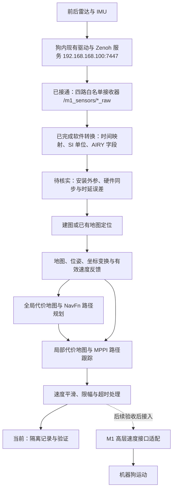

# M1 / Orin 导航项目说明与代码阅读指南

2026-09-13 更新：[静止复检](STATIONARY_CHECK.md)的三分钟输入窗口通过，源端到接收的缺口仍有记录；完整预检因真实外参缺失退出 2，硬件同步未验收。以下历史结果按各自窗口解释。

维护日期：2026-09-13。本文介绍功能、实现办法和代码阅读重点；具体测试数据以 [导航验证记录](ROAMERX.md) 为准，设备接口以 [M1 接口核查](M1_INTERFACES.md) 为准。

## 1. 项目要完成什么

目标是让 M1 利用真实雷达与 IMU 感知环境，在地图中定位，规划路径，并通过匹配的底盘接口完成导航。算法主体采用厂商 RoamerX；本仓库负责连接、依赖隔离、编译、数据检查、适配准备与验证。

目前软件构建、隔离功能测试、真实传感器接收和输入转换已完成验证。新增 20 项录包故障检查、7 项 ROS 节点保护测试通过；上一轮真实预检因后点云出现 0.300004 秒间隔锁定输出；本轮重审时间后的三分钟输入窗口通过，缺口根因仍未解决。实机外参、硬件同步/时延精度、建图定位及真机运动仍待完成。最新结果见 [输入故障检查](INPUT_FAULT_TESTS.md)。

| 功能 | 当前完成程度 | 主要实现位置 |
| --- | --- | --- |
| 登录 Orin、检查内网 | Orin 公钥登录已通；狗内板卡登录未确认 | `scripts/`、`m1_preflight/inspect_network.py` |
| 全局规划示例 | 本机、Orin 三个合成场景通过 | `experiments/navfn/` |
| 完整导航构建 | 20 个 RoamerX 包构建通过 | `m1_preflight/build.sh` |
| AIRY 驱动准备 | 点云 XYZIRT、IMU 解析编译通过；未启动真实采集 | RoboSense SDK、`m1_preflight/build_sensors.sh` |
| 真实数据接入与检查 | Zenoh 接收前后点云各约 10 Hz、IMU 各约 200 Hz；独立 ROS 接收和录包通过 | `m1_preflight/zenoh_sensor_bridge.py`、`observe.py` |
| 导航插件与速度平滑 | 插件配置、合成指令限幅与断流归零通过 | `m1_preflight/navigation_preview.launch.py` |
| 传感器输入适配 | 2724 条真实消息转换、11 项异常测试和 30 秒在线验证通过；标定缺项拒绝 | `m1_preflight/airy_adapter/` |
| 建图、定位、实际避障与运动 | 等待真实数据、坐标时间适配及控制接口验证 | RoamerX SLAM、localization、navigation |

## 2. 整体工作流程

以下是目标数据流。图中的“适配”包含尚待实现或验证的工作。

建图与定位是两种工作方式：建图逐步构建环境地图；定位利用已有地图估计当前位姿。规划器需要地图与当前位置，控制器还需要可信的当前速度和附近障碍信息。

头部 RTSP 相机已经出图，但当前导航主线是雷达与 IMU。看到相机画面不代表点云或定位正常。机械臂和另一套 locomotion 策略工程也不是本仓库的导航入口。

## 3. 目录与代码归属

| 目录 | 内容 | 应如何阅读和修改 |
| --- | --- | --- |
| `experiments/navfn/` | 我们写的离线规划验证程序 | 最适合入门，地图生成、算法调用、验证在同一流程 |
| `m1_preflight/` | 我们写的部署和预检工具 | 理解环境、数据检查、参数生成与运行边界 |
| `third_party/genisom_roamerx_open/` | 固定版本的厂商导航源码 | 主要算法在这里；版本由根目录 `upstream.lock.json` 固定 |
| `third_party/rslidar_sdk/`、`third_party/rslidar_msg/` | 本机已有的官方雷达驱动、消息包源码 | 读解码与消息发布；版本及补丁记录在 `m1_preflight/` |
| `vendor/sdk/` | 原始 M1 低层 SDK，含 ARM64 / x86_64 两种构建 | 读公开头文件和说明，动态库本身不是可阅读的源代码 |
| `vendor/robot_description/` | URDF、STL、传感器位置表 | 核对几何模型、单位和关节；不能替代实测外参 |
| `vendor/archives/` | 原始 0、1、2 包 | 留作来源追溯，不作为活动开发目录 |
| `docs/evidence/` | 构建、采样、预检报告 | 用来判断某个功能实际验证到了哪一步 |
| `build*`、`install*`、`log*`、`artifacts/` | 生成的二进制、安装树、日志及结果 | 初读时跳过；不要在这里修改源代码 |

上游源码下载目录通常被 Git 忽略。重新取得源码应使用带固定版本的获取工具；修改第三方代码要留下补丁和理由，不能把临时改动当成上游原版。

### 本机与 Orin 的路径对应

本机仓库：`/home/hezhou/data/workSpace/project/Sci-Tech/competition/ATEC/ros2_nav_repro`。
Orin 工作区：`/home/nvidia/Workspace/ljy/navigation`，实际存储在 NVMe。

| 本机位置 | Orin 对应位置（相对工作区） |
| --- | --- |
| `third_party/genisom_roamerx_open/src/` | `src/` |
| `m1_preflight/` | `m1_preflight/` |
| `experiments/navfn/` | `experiments/navfn/` |
| 本机已有 `third_party/rslidar_sdk/`、`third_party/rslidar_msg/` | `sensors/src/rslidar_sdk/`、`sensors/src/rslidar_msg/` |

AIRY 获取脚本当前默认写到工作区的 `sensors/src/`；需要本机原来的 `third_party/` 布局时显式指定 `--source-root third_party`。它们是不同位置，阅读时先看实际目录。Orin 原厂 `README.md` 保留上游说明，项目入口是 `M1_WORKSPACE.md`。

## 4. 必须理解的几个概念

| 概念 | 在本项目中的意思 |
| --- | --- |
| ROS 节点、话题 | 节点是运行的模块，话题是模块交换消息的通道。存在话题名不等于已有发布者或有效数据 |
| PointCloud2 | 点云消息容器；字段可因驱动而异，相同消息类型不代表相同点布局 |
| IMU | 加速度、角速度等惯性测量。姿态四元数不能代替缺失的加速度 |
| TF、frame_id、外参 | TF 描述坐标系间变换；frame_id 指数据所在坐标系；外参描述传感器相对机体的位置和旋转 |
| 里程计 Odometry | 包含位姿和速度等字段；必须确认发布端实际填入的含义，而不是只看类型名称 |
| 地图与代价地图 | 地图描述环境；代价地图进一步表达障碍和接近障碍的代价，供规划控制使用 |
| QoS | ROS 消息交付策略；发布和订阅的可靠性等设置必须兼容 |
| 生命周期 | 节点可处于未配置、未激活、激活等状态。插件配置通过不代表已在执行导航 |

常见坐标链目标是 `map → odom → base_link → 传感器`。外参需要完整的平移和旋转，传感器位置表只有毫米单位的位置，不能直接当作完整 TF。设备时钟也必须核验，接收时刻不自动等于测量时刻。

## 5. 按功能追代码

### 5.1 最容易上手：地图怎样变成路径

先读 [离线示例 main.cpp](../experiments/navfn/main.cpp)，再读 [NavFn 算法 navfn.cpp](../third_party/genisom_roamerx_open/src/navigation/src/navigo_navfn_planner/src/navfn.cpp)。

示例的实现顺序是：生成栅格与障碍 → 计算障碍距离和代价 → 设置起终点 → 调用 `calcNavFnDijkstra()` → 用 `calcPath()` 提取路径 → 对路径线段采样检查 → 保存结果。`plot.py` 负责画图，不参与路径计算。

这里的 Dijkstra 方法先在代价地图上计算势场，再提取路径。重点把握栅格索引、米与格子的换算、障碍不可通行条件，以及找不到路径时如何返回失败。合成地图上的测试间距不是 M1 实测机体尺寸。

完整 ROS 导航通过 [navfn_planner.cpp](../third_party/genisom_roamerx_open/src/navigation/src/navigo_navfn_planner/src/navfn_planner.cpp) 的 `NavfnPlanner::createPlan()` 接入算法。对比它与离线示例，可以区分“算法核心”和“ROS 插件封装”。

### 5.2 路径怎样变成速度

先读 [MPPI controller.cpp](../third_party/genisom_roamerx_open/src/navigation/src/navigo_mppi_controller/src/controller.cpp) 的 `computeVelocityCommands()`，再读 [optimizer.cpp](../third_party/genisom_roamerx_open/src/navigation/src/navigo_mppi_controller/src/optimizer.cpp) 的 `evalControl()` 和 `optimize()`。

MPPI 根据当前位姿、速度、参考路径与代价地图评估候选运动轨迹，更新控制序列并给出速度。阅读时追踪四件事：当前状态在哪里输入、候选控制怎样生成、评分怎样影响选择、速度限制在哪里生效。先把调用关系看懂，再深入优化公式和各评分项。

控制器需要真实速度反馈。当前定位代码把输出速度填零，不能直接接上就认为反馈闭环已经成立。速度平滑层的断流归零只证明软件输出行为，不能据此认定机器狗已经具备可靠制动能力。

### 5.3 雷达数据怎样进入程序

RoboSense 驱动负责把雷达网络数据解码并发布 ROS 消息；M1 SDK 负责机器人状态与控制。已检查的 M1 SDK 没有公开雷达点云订阅接口，不能用低层连接代替雷达驱动。

读官方驱动时，从 `rslidar_sdk/node/rslidar_sdk_node.cpp` 进入 `src/manager/node_manager.cpp`，再追到 `src/source/source_driver.hpp` 和子模块 `src/rs_driver/`。关注配置读取、数据源创建、解码回调和消息发布。

本项目备用 RoboSense 驱动已编译 XYZIRT 和 IMU 解析支持，未启动原始 UDP 驱动。当前复用狗内已有发布服务：`192.168.168.100:7447`，通过固定的 Zenoh 键前缀 `24` 订阅前后点云与 IMU，无需登录板内 SSH。

读 [zenoh_sensor_bridge.py](../m1_preflight/zenoh_sensor_bridge.py) 的 `STREAMS` → `main()` → `callback()`：白名单确定四路传感器，Zenoh 回调取得 CDR 字节，`deserialize_message()` 还原标准 ROS 消息，再通过 sensor-data QoS 发布到本机 `/m1_sensors/*_raw`。`save_status()` 统计频率、错误、时间回退和接收新鲜度；[run_sensor_bridge.sh](../m1_preflight/run_sensor_bridge.sh) 固定 localhost/domain 0 并用进程锁防止重复启动。这条链没有向狗内发布消息或建立 SDK 控制会话。

实测点云字段为 XYZIRT、96 线，坐标系 `rslidar_head` / `rslidar_tail`。原始时间和数值全部保留：前雷达快约 154 秒，后雷达运行时长式时钟跨采集回退，IMU 加速度为 g、姿态为默认值。因此“收到原始数据”已经通过，“可供导航融合”还需要单位、时钟、有效性和安装外参适配。原始 UDP 地址仍未确认，也不需要为当前接收方式修改雷达网络。

### 5.4 点云与 IMU 怎样用于建图定位

新增 [adapter_core.py](../m1_preflight/airy_adapter/adapter_core.py) 处理固定时间偏移、SI 单位、姿态未知和时钟故障；[adapter_node.py](../m1_preflight/airy_adapter/adapter_node.py) 发布本机验证输入。[airy_preprocess.h](../m1_preflight/airy_adapter/airy_preprocess.h) 是原生 XYZIRT 解码：先检查有限点、96 线和帧内时间，排序后把毫秒写入内部 curvature。独立 RoamerX 副本通过类型 5 调用它，不会伪造 Livox tag。

时钟不是逐帧换成到达时刻：同一雷达的点云/IMU 共用一个固定偏移，保留相对采样关系。板间偏移来自只读参数响应；后雷达时钟原点仍含未核实的驱动延迟差。IMU 的默认姿态用 covariance[0]=-1 标记为不可用。独立 IMU frame 需要真实 LiDAR–IMU 标定后才能连入 TF。

[prepare_mapping.py](../m1_preflight/airy_adapter/prepare_mapping.py) 只有在核实安装及 LiDAR–IMU 变换来源、平移和旋转后才生成单前雷达配置；目前缺项，拒绝生成。不要把通过解码和时间检查当作 LIO 已能定位。

先读 [lidar_process.cpp](../third_party/genisom_roamerx_open/src/slam/src/src/process/lidar_process.cpp)，再看 [mapping_alg.cpp](../third_party/genisom_roamerx_open/src/slam/src/src/mapping_alg.cpp) 如何接收、组织点云与 IMU 并发布结果。

当前 `Preprocess::process()` 固定走 `avia_handler()`，点类型是 Livox 的 `timestamp/line/tag` 等字段。AIRY XYZIRT 的字段与时间约定不同；现在通过独立副本中的原生类型 5 分支适配并用真实 CDR 验证。原始 checkout 中该限制仍保留，不能只对原版改参数。

已有地图定位入口是 [localization_nodelet.cpp](../third_party/genisom_roamerx_open/src/localization/localization/apps/localization_nodelet.cpp)，重点看点云/IMU 回调和 `publish_odometry()`。该文件虽然名称带 nodelet，仍应按当前代码及构建方式理解，不凭文件名判断 ROS 版本。

当前需解决：SLAM 发布 `map → body`，与目标坐标链不同；定位 TF listener 创建被注释，速度填零，且 covariance 中存在非标准置信度用法。要分别核验坐标关系、速度来源和消息语义，不能简单把这些输出转发给控制器。

### 5.5 我们怎样组织和验证这些模块

读 [prepare_preview.py](../m1_preflight/prepare_preview.py)：它从上游参数生成独立预检配置，显式接收地图、里程计/扫描话题、坐标系和外形，调整时钟、限速及速度平滑参数。

再读 [navigation_preview.launch.py](../m1_preflight/navigation_preview.launch.py)：它组装地图、规划、控制、行为、速度平滑、行为树和航点节点，放进 `/m1_preview`，默认不激活生命周期，不加载厂商运动桥接。

[observe.py](../m1_preflight/observe.py) 则从外部观察话题发布者、样本数、字段、频率和 TF。它不启动 SDK。`audit_recorded_state.py` 只分析已有 JSONL；文件校验成功不代表可以直接用于导航。

### 建图前怎样检查真实输入

[run_preflight.sh](../m1_preflight/airy_adapter/run_preflight.sh) 串联时钟重新审计、180 秒有限时适配、逐帧核验和外参检查。[check_live.py](../m1_preflight/airy_adapter/check_live.py) 只读消息头，比较同一设备时间戳的 raw 与校正输出，报告实际缺帧；报告中传输通过、标定通过和建图可用分别记录，不用其中一项代替其他项。

[fastdds_sensors.xml](../m1_preflight/fastdds_sensors.xml) 为这几个进程配置 64 MiB 共享内存，解决大点云超过默认共享区的问题。进程只使用本机共享内存，不修改系统网络参数。原始 Zenoh 接收链保持四路传感器白名单；预检不创建控制 SDK 会话、TF 或运动指令。

标定资料核查范围及未取得信息见 [calibration_search.json](evidence/calibration_search.json)。另一工作区的 X30 参数、URDF 的碰撞模型与 M1 标称安装平移都不能补足实机旋转和雷达内 IMU 标定。精确同步仍需要设备状态或独立标定依据。

### 坐标链接入与实际规划调用的验证

[坐标模块](../m1_preflight/coordinates/README.md) 将 IMU 位姿通过真实外参变为机身位姿，再结合局部里程计计算 map←odom。当前仅在 domain 179 用合成外参通过消息验证，真实标定缺失会拒绝启动；它不复制上游无效的速度/协方差，也不重复发布局部 odom→base_link。

[规划服务验证](../m1_preflight/verify_planner_paths.py) 在 domain 178 运行真实 RoamerX 规划器，对合成障碍地图检查绕行路径和墙内目标拒绝，不加载运动控制器。记录见 [规划结果](evidence/planner_paths.json)。

[设备信息读取准备](../m1_preflight/airy_adapter/extract_airy_difop.py) 只解析已有文件中的 AIRY DIFOP 候选。设备对应关系、单位和板内驱动变换未核实前，不能把解码数值自动导入实机标定。新录包分析同时统计 IMU/点云间隔，避免只凭平均频率掩盖偶发缺帧。

### 输入质量定位与运行保护

[缺口审计](../m1_preflight/airy_adapter/audit_gaps.py) 比较设备时间、源发布序号及两个接收路径，区分已存在的消息被不同接收链漏掉的情况。[运行状态机](../m1_preflight/airy_adapter/stream_guard.py) 与 [转换入口](../m1_preflight/airy_adapter/adapter_engine.py) 被线上节点和录包故障测试共同调用；定时断流检查独立于消息回调，故障锁定全部输入适配输出。

故障回放使用已存真实录包与虚拟时钟，ROS 故障注入使用 domain 180 合成消息，均不接执行器。详细阈值、20 项回放、7 项 ROS 验证及真实数据触发保护的结果见 [输入故障检查](INPUT_FAULT_TESTS.md)。当前真实稳定性预检未通过；保护通过不代表源缺口已经消除。

### 5.6 最后一道接口：怎样让机器狗执行速度

上游 [vel_cmd_udp_publisher.cpp](../third_party/genisom_roamerx_open/src/navigation/src/robot_navigo/src/vel_cmd_udp_publisher.cpp) 订阅速度并发送旧版 UDP 控制包。它还不是我们适配完成的 M1 控制接口。

当前已知旧桥接使用 43997/43988，而 M1 高层文档使用 8082/8081。新增 [SDK 手册核查](SDK_MANUAL_REVIEW.md) 明确其所涵盖版本：0.1.0 及以前用 8081、0.1.1 用 8082；不能将旧文档“最新版”外推到当前库。区别不只是端口：消息格式、控制权、归一化 Move 输入、速度等级、单位换算与超时行为都需要验证。未来适配应独立记录，不静默修改上游协议。

原始 `vendor/sdk/` 是 8083 低层关节控制。Initialize 即可切换控制权；即使程序不发运动命令，也不能当作只读网络探针。代码阅读不需要运行这些示例。

## 6. 推荐阅读顺序

| 顺序 | 阅读内容 | 读完应能回答 |
| --- | --- | --- |
| 1 | 本文、根 README、`docs/ROAMERX.md` | 项目要做什么，哪些已经验证？ |
| 2 | `experiments/navfn/main.cpp`、`plot.py` | 输入地图如何得到路径和验证结果？ |
| 3 | `navfn.cpp`、`navfn_planner.cpp` | 算法核心如何接入 ROS？ |
| 4 | `prepare_preview.py`、`navigation_preview.launch.py` | 参数如何传给节点，输出怎样隔离？ |
| 5 | MPPI `controller.cpp`、`optimizer.cpp` | 路径、位姿、速度和障碍如何影响控制？ |
| 6 | `observe.py`、点云预处理、建图和定位入口 | 数据字段、时钟、TF 是否满足模块要求？ |
| 7 | 厂商控制桥接与 M1 SDK 说明 | 导航速度与实际执行器之间还缺什么？ |

每读一个模块，记录“输入、输出、单位/坐标系、失败时的行为、验证证据”五项。先沿一个函数调用链看完整过程，不必一开始遍历所有 ROS 包。

## 7. 运行与修改时把握的边界

本机可以运行根目录 `scripts/run_navfn_demo.sh` 学习离线规划。完整构建与 ROS 运行验证放在 Orin Humble / 系统 Python 3.10 环境；另一工程的 locomotion Python 3.11 虚拟环境不应混用。具体命令集中维护在 [预检说明](../m1_preflight/README.md)，本文不重复复制整套部署步骤。

优先修改我们自己的 `m1_preflight/` 和 `experiments/`；涉及上游源码时保留来源与补丁。设备参数必须注明是实测、厂商标称还是测试值。先观察真实数据，再适配算法，最后验证运动输出。

当前推进顺序是：确认板卡与数据配置 → 真实点云/完整 IMU → 建图定位 → 隔离规划控制 → 现场低速实机。控制接口协议、AIRY 数据适配、时间同步、完整外参和有效速度反馈仍是重点。

## 8. 本文怎样持续维护

- 增加、删除或改动主要模块时，同步更新功能表、数据流和对应实现入口。
- 更换源码目录、入口、消息字段、单位、坐标系或 SDK 版本时，同步更新本文与接口说明。
- 新测试通过后，详细结果写入 `docs/ROAMERX.md` 并链接证据；本文只更新功能边界，不积累流水日志。
- README 保持简短入口；本文负责功能与实现；`m1_preflight/README.md` 负责操作；AGENTS.md 负责协作约定与确认事实。
- 每次文档修改检查源文件链接，并标明维护日期。同步到 Orin 时将本机第三方源码链接换成对应远端布局，保留上游 README。
