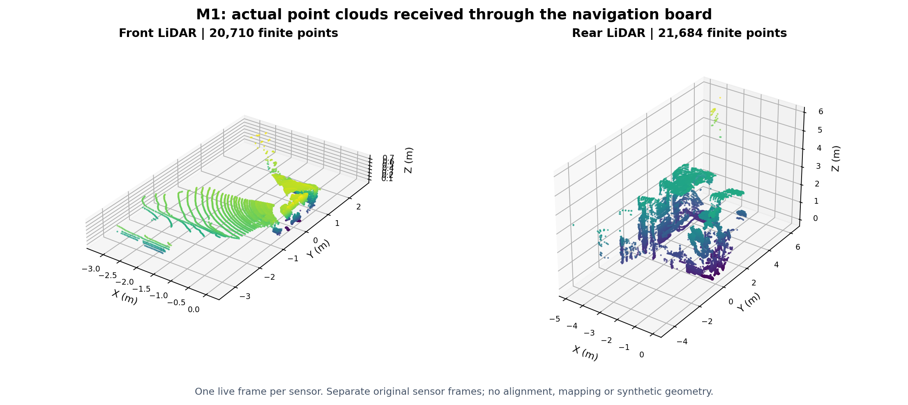
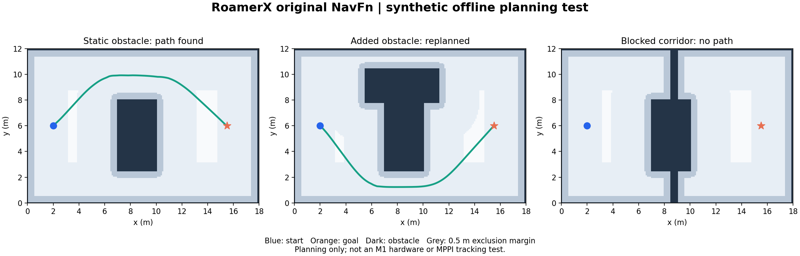

# RoamerX 导航验证

## 静止检查复核（2026-09-13，优先于下方历史状态）

- 用户授权独立连续性、可读配置、时钟和静态几何检查；需要物理测量、移动标定或建图采集时通知。未建立 SDK 会话、未发布运动、未启动建图。
- 开始时接收器已因后 IMU `source_publisher_changed` 锁住；保留 `source_change_before_stationary.json`。60 秒独立源观察发现四路 GID 均已不同于旧记录，窗口内新 GID 各自稳定、无重复/回退，后雷达计时起点改变。支持源发布者重建/重启的可能，不能确定是哪个进程或整机重启。
- 确认来源稳定及无本任务 SLAM/适配进程后，仅显式重启自己的接收器，重新审计时钟；没有修改狗内服务、网口或系统时间。接收器新增有界最近 20 次缺口、回调/发布最大耗时及故障源身份记录。
- **本次 180.108 秒输入窗口通过**：点云前/后 9.95984/9.95962 Hz，IMU 199.879/199.865 Hz；内部原始唯一帧 1723/1723/34576/34575 均找到适配输出，缺失 0、无适配故障。窗口内最大点云间隔约 200 ms、IMU 20 ms。完整预检仍因四组真实外参缺失退出 2；不是建图或整机准备通过。
- 源端到接收之间缺口仍存在：接收器重启后的准备阶段又记录后点云 0.299999 秒间隔（在正式适配窗口之前）；不得用上述窗口通过覆盖既有 300 ms 故障，`source_gap_root_cause_fully_resolved=false`。静态直接源观察缺失序号数前点云 3、后点云 2、两 IMU 各 5，未见连续序号下大时间缺口。
- Orin eth1 累计 errors/dropped/missed 仍为 0，不能据此排除发送队列、Zenoh 或应用层问题。新增回调统计显示此接收器本窗口点云回调最大约 23 ms、发布约 5 ms；不能凭此唯一归因源端。
- 两轮只读时钟审计相距 421.178 秒，板间偏移从约 -152.5564 秒变为 -152.5827 秒，变化范围 -28.506 至 -23.971 ms；不是单一永久常数，不能推断是哪台钟调整或当作硬件同步误差。Orin NTP 显示同步，仅证明 Orin 自身状态。600 秒软件 profile 不代表长期同步精度保证。
- 新静止采样前/后 IMU 加速度模长中位数约 1.0022/0.9995 g，方向靠近原始 +Y（偏角约 1.25°/2.35°）。陀螺平均向量非零，可能含零偏，未直接减去或当作真实旋转速度。原始 frame 共名不证明轴对齐，不能套机身 +Z。
- 前后各 20 份 CDR，0.2–15 m 内有限点约 2.18万–2.75万。前雷达主要平面离原点约 0.685–0.696 m、法向接近 -Z；后雷达主平面多接近 -X。平面未标注地面/墙体，不据此写外参。首版新探针组织点云轴拼接错误已修正为 height×width×xyz 展平，同批 CDR 重算并通过已知倾斜平面验证；生产转换未受影响。
- 重读可访问标准参数和 tf_static：rslidar 参数服务仍超时，其他节点仅常规参数；静态边仍只见默认 map→odom，没有雷达安装变换；未取得设备 DIFOP。没有登录 .100 文件系统，不能说已查遍板内配置。完整静止报告见 `docs/STATIONARY_CHECK.md`。
- 当前本任务有限时适配器已正常停止（state=stopped），原始接收器继续只读运行，PID 以远端 pid 文件并核对 cmdline 为准。接下来需设备标定/驱动配置可读入口或现场安装测量，之后才考虑移动标定和建图采集。


## 最新输入缺口与保护状态（优先于早期通过记录）

- 用户明确本轮先完成缺口定位、运行保护、故障回放，现场测试后续配合；未授权本轮运动。结果汇总 `docs/INPUT_FAULT_TESTS.md`。
- `audit_gaps.py` 用 180 秒设备时间/发布序号/发送时间/独立 ROS 接收对照。前点云/前 IMU/后点云/后 IMU 发现序号缺口事件 35/51/11/63；缺失序号数 37/158/12/181，其中其他接收链在对应时间区间收到 6/102/7/111 个样本。全部异常为序号缺口，没有连续序号下的设备时间断档；仅定位到序号分配到探针之间，尚不能唯一归因发送队列、Zenoh 或客户端，不能宣称物理雷达漏采。双路探针增加负载，数据仅适用于该窗口。
- 线上改用 `AdapterEngine` / `InputGuard`：四路有效后才输出，独立定时检查；IMU 静默 100 ms、点云静默 350 ms、相邻接收样本设备时间差 50/250 ms 超限均锁定全部适配输出。错 frame/字段/非有限数据、回退重复、主机跳时、过期 profile 和发布者变化也锁定，数据恢复不自动清除。
- 时钟 profile 最多 600 秒；启动等待 5 秒。消息年龄 IMU ≤250 ms、点云 ≤500 ms，允许超前最多 50 ms。阈值是软件预检界限，不是硬实时或建图精度验收。每轮循环最大空闲等待 10 ms，Linux 调度可使实际检测更慢。
- Humble 已安装 rclpy 不支持带 MessageInfo 的双参数回调，底层 take_message 的信息也仅含发送/接收时间；已修复为单参数回调 + ROS 发现图唯一发布者 GID 检查，不能称逐消息来源认证。首次失败日志保留 artifacts/fault_ros；修复后 artifacts/fault_ros_fixed 全部通过。
- 原始 Zenoh 接收器增加逐消息 attachment GID/序号核查。源 GID 改变、序号重复/倒退或解析错误锁住原始转发，状态包含 forwarding_enabled/source_fault/source_gid/sequence_gaps；序号缺口只记录。已核对进程身份后显式重启自己的接收器，未重启狗内服务或 SDK；原脚本/状态备份在 artifacts/real_sensors/bridge_before_source_guard.*。
- 真实 12264 条基线及故障回放共 20 项通过（含未来配置、设备时钟突跳）；实际 ROS domain 180 七项故障测试通过，IMU 断流实测 101.2 ms，所有故障后队列排空再观察无新输出，数据恢复不自动续发。原 11 项适配检查也通过。
- **新版真实三分钟输入预检未通过稳定性**：约 126 秒时后点云出现 0.300004 秒间隔，超过 0.25 秒阈值并锁住输出。最终前/后点云输出 1233/1258、IMU 25273/25264，有限时进程随后结束。保护按预期生效，但不能把这次结果记成稳定性通过；不要用先前无此保护的通过结果覆盖当前故障。
- 原始接收器继续运行，forwarding_enabled=true、source_fault=null；适配器已退出且故障状态保留。恢复必须先排查原因、结束旧定位/建图、显式重启所需进程、重新审计时钟并初始化，不能只清空故障字段。run_preflight.sh 现在先拒绝不新鲜/已锁定的原始接收状态。
- 新证据 `gap_audit.json`、`fault_replay.json`、`fault_ros.json`、`guarded_preflight.json`、`guarded_adapter_status.json`、`guarded_bridge_status.json`。真实外参、同步状态及现场定位仍未验收，hardware_preflight_complete=false。


## 最新独立准备验证（2026-09-12）

- 用户授权继续独立完成资料检索、源码核查、适配、录包分析、预检、坐标链接入及隔离规划，现场操作留到准备确认后；没有运动授权、未触发 SDK/标定动作。
- 新增 `m1_preflight/coordinates/`：按实际外参计算 base←IMU、map←base、map←odom，限定 localhost/domain 179 私有 TF 图。6 项几何测试与 ROS 消息验证通过（401 条变换、2 条静态边、时间回退拒绝）；使用真实缺项 calibration.json 会在创建 ROS 节点前退出 2。它是可执行软件准备，**不是实机坐标链已经接通**。
- 新增 `verify_planner_paths.py`：localhost/domain 178 仅启动地图和规划器；真实 RoamerX ComputePathToPose 服务给出绕墙路径 292 点/14.65 m，点级占用检查无碰撞，墙内目标正确 aborted；根速度话题无发布者。不是实际地图或控制器闭环验收。
- 新录包命令持续 30 秒，NVMe `artifacts/real_sensors/bag_before_mapping_30s` 实际 12264 条消息：前后点云 291/292、IMU 5841/5840。全部转换通过，逐点相对时间误差仍 ≤0.477 μs；IMU 无重复/回退，内部覆盖点云最少 13/14 条 IMU。各一路有一次 >15 ms 间隔，最大 40/35 ms；前点云最大间隔约 0.20 秒。不能将单位/格式通过描述为源采样连续性完全通过。
- 新录包的两个 CDR 经原生 AIRY C++ 路径通过。验证器新增间隔统计，后续导出 CDR 位于每个报告独立的 `<stem>_cdr/` 子目录。
- AIRY 固定驱动 `decoder_RSAIRY.hpp::decodeDifopPkt` 明确读取出厂 IMU quaternion/translation 到 device_info，可通过 `LidarDriver::getDeviceInfo` 取得；当前 ROS 四路原始消息不携带这些字段。新增纯文件 `extract_airy_difop.py` 和 4 项测试，保留未核实标志、不自动生成实机外参。既有 PCAP 仅 24 字节头，未找到 DIFOP。
- 只读 TF 缓存查询没有返回安装变换，实时 tf_static 仍只有默认 map→odom。收到 21 字节 ArcModuleState 消息，但当前上游没有对应 IDL，因此只统计长度，未解读或执行 perception_calibration_cmd。没有把“收到标定状态”写成“标定完成”。
- 复核已存真实 mc_odom/current_pose CDR：父 odom、子 base_link，有 twist 数值；这是历史样本，物理单位、动态精度和新鲜时间接入仍未验收。不能拿 current_pose 的 odom 父坐标冒充全局 map 位姿。
- 上游 SLAM 的 map/body 位姿由 IMU 状态给出；其 covariance 在 publish 之后更新，定位还混用置信度/协方差及零 twist。坐标适配仅消费位姿，不复制这些值作为标准速度/协方差，未修改上游源码。
- 新搜到厂商公开 zsibot_roamerx_lite 的 SLAM 配置仍是 Livox 类型/4 线与既有外参，不作为 AIRY 标定；odometry_calibration.xml 是实际走方形的动作树，未运行。CyanTempest/Navigation 仍不可读取，没有切换导航栈。
- 新增证据 `coordinate_ros_check.json`、`planner_paths.json`、`bag_before_mapping_30s_check.json`、`bag_before_mapping_native.jsonl`、`calibration_routes.json`、`difop_search.json`、`odom_samples_audit.json`。21 项单元检查通过（11 适配 + 6 几何 + 4 DIFOP）；hardware_preflight_complete 仍为 false，实机外参、驱动变换配置、同步状态及实际定位链是剩余缺口。


## 建图前复检与传输修复（最新，2026-09-12）

- 新增 `m1_preflight/airy_adapter/run_preflight.sh`：刷新时钟审计、180 秒有限时适配、逐帧检查、外参检查；输入/外参缺项返回 2，不启动建图或控制 SDK。原始接收器需先运行，预检只关闭自己启动的适配子进程。
- 复核旧接收器约 2.5 小时数据：点云约 9.83/9.92 Hz，IMU 199.52/199.40 Hz，累计无解析错误/重复/时间回退。该结论仅限连续窗口，不推翻此前后雷达跨采集时间回退的记录。
- 实测默认 Fast DDS 共享区约 512 KiB，小于约 2 MB 点云。修改前 180 秒检查，前/后点云窗口内缺少对应适配输出 126/272 帧。新增 `m1_preflight/fastdds_sensors.xml`：64 MiB SHM、8 MiB 单消息、2048 队列、关闭内置网络传输。只用于我们接收器/适配器/预检进程，没有修改系统 sysctl 或狗内服务。
- 已核对 `/proc/PID/cmdline` 后正常停止并重启自己的原始接收器，保留 `bridge_before_shm.json`；该人工重启产生计数重置，不是设备时钟回退。新 PID 仍以远端 `artifacts/real_sensors/live_bridge.pid` 为准。
- 修改后 180 秒逐帧观察通过：前/后点云 9.9607/9.7660 Hz，IMU 199.4540/199.3128 Hz；去首 5 秒、尾 2 秒后的 raw 唯一帧 1723/1690、IMU 34505/34478，全部找到校正输出对应帧，缺失为 0，适配错误/时钟故障为 0。此为本机接收后链路验收，不宣称源端无丢失：原始点云最大间隔约 0.20 秒，IMU 最大约 45/35 ms。
- 原始接收器继续运行，有限时适配器已退出。根速度话题计数为 0 的结论仅限预检进程可发现的共享内存 ROS 图；不表示狗内或其他传输不存在控制流。本任务没有建立运动链路。
- 搜索记录 `docs/evidence/calibration_search.json`：本机 SDK、模型、微信说明、参考资料以及外接 Orin 可读配置均未找到可核实为本 M1 的完整外参。Orin 的 `ros2_ws/src/fastlio_terrain_navigation` 是 X30 参考工程，未改动、未复用其 0.826 m 安装参数。未登录狗内 .100，不能声称已查过它的文件系统。
- Orin 实测 `NTP=yes`、`NTPSynchronized=yes`，由 systemd-timesyncd 对时；这不能证明板内/雷达同步。最新软件板间偏移约 -153.366 秒，区间半宽 0.923 ms，不代表传感器精度。时钟 profile 仍只有 600 秒有效期。
- 11 项适配测试复跑通过，预检整项退出 2，原因是真实外参缺失；`prepare_mapping.py` 拒绝生成配置。当前 `input_transport_passed=true`，但 `mapping_ready=false`、`hardware_preflight_complete=false`。待取得前雷达完整 base←LiDAR、IMU←LiDAR 以及同步/时延依据后才能完成建图准备验收；双雷达融合还需后雷达标定与相对时差验证。
- 证据：`docs/evidence/live_preflight_before_shm.json`、`live_preflight.json`、`bridge_before_shm.json`、`calibration_search.json`。历史 7.6 Hz 适配记录由本次修复后的窗口更新，不能再作为当前传输效果。


## AIRY 输入适配与当前验收边界

2026-09-12 已完成软件时间映射、IMU 单位修正、无姿态标记及 RoamerX 原生 AIRY 解码，编译和真实数据验证通过。**完整真机前置准备尚未通过：安装外参未知，后雷达的软件时钟原点估计不能证明精确同步。**

| 验证 | 实际结果 | 限制 |
| --- | --- | --- |
| 板间时钟 | 只读响应测得狗内板比 Orin 快约 153.38 秒；复测区间半宽 0.77 ms | 未修改系统时钟；区间不包含未知的传感器/驱动延迟 |
| 同雷达时间映射 | 点云头、逐点时间和 IMU 使用固定偏移，回退/跳变停止输出 | 后雷达原点由发布时间估计，未证明双雷达同步；配置 10 分钟过期 |
| IMU SI 和有效性 | 加速度、协方差完成转换；姿态未知标记；单独 IMU frame | 未发布未经标定的 TF |
| 全量真实录包 | 2724 条转换通过，122 帧点云全部有帧内 IMU，最少 18 条/帧；逐点相对时间变化 <0.5 µs | 录包覆盖不等于运动去畸变精度已验证 |
| 原生 AIRY 预处理 | 原始/转换后的前后 CDR 共 4 份解码通过；原始首帧有限点 20710/21684，帧内时间约 0–100 ms | 没有生成 Livox tag，没有运行缺外参的 LIO |
| 在线 30 秒 | 前/后 IMU 5965/5969、点云各 258，错误 0；独立 ROS 观察到校正后时间 | 独立点云观察约 7.6 Hz；传输负载和丢帧还需长期检查 |
| 异常防护 | 11 项测试通过；缺标定的建图配置生成明确失败 | 当前拒绝是预期行为，不是建图成功 |

代码与操作入口：[AIRY 输入适配](../m1_preflight/airy_adapter/README.md)。副本 `src_airy/robot_slam` 新增 lidar_type=5，绝对逐点秒减帧首秒后转内部毫秒，并在入队前排序。固定上游未修改；完整 robot_slam 独立构建完成 3min25s。适配后的测试进程已关闭，原始四路接收器保留运行。

证据：[汇总](evidence/airy_adaptation_readiness.json)、[真实录包转换](evidence/adapter_recording_check.json)、[在线观察](evidence/adapter_live_observer.json)、[原生 CDR 解码](evidence/native_airy_check.jsonl)、[时钟审计](evidence/clock_audit_summary.json)、[板内 TF](evidence/board_tf_probe.json)。

仍需这台机器实际 `base_link ← LiDAR` 的完整安装变换、各雷达 `IMU ← LiDAR` 出厂标定/DIFOP，以及同步状态或独立测得的延迟误差。只读 TF/参数检查和用户新提供的 [SDK 使用说明](SDK_MANUAL_REVIEW.md) 都没有给出这些值。不能把厂家标称平移加零旋转当作确认。

## 真实传感器验收（2026-09-12 19:45 后）

2026-09-12 19:45 起已接通真实前后点云和 IMU：狗内导航板 `192.168.168.100:7447` 的 Zenoh 服务 → 外接 Orin → `/m1_sensors/*`。接收数据不需要狗内板 SSH；建图、定位和运动尚未验收。

独立的 15 秒 Zenoh 订阅收到前/后点云 150/149 帧、前/后 IMU 各 3000 条，CDR 解码错误为 0；另收到 `odom/mc_odom` 约 48.66 Hz、`odom/current_pose` 约 29.23 Hz，仅作原始数据审查，常驻接收器不转发它们。发现 SLAM/定位路由不代表有输出，该窗口未收到对应样本。

独立 ROS 观察收到全部四路；持续接收脚本在 Orin 运行，无控制会话和速度输出。录包 6.547849108 秒、2,724 条、261.4 MiB，保存于 Orin NVMe 工作区 `artifacts/real_sensors/bag_20260912_live/`。前/后点云分别 60/62 条，前/后 IMU 1307/1295 条。



图为各取一帧的有限点，保留两个雷达各自坐标系；未配准、未建图。首帧点槽 82,464/86,400，有限点 20,710/21,684；字段 `x/y/z/intensity/ring/timestamp`、point_step=26、ring=0..95。逐点时间为设备时钟的绝对秒，相对帧首约 0–0.1 秒，不能直接按 Livox 纳秒读入。

下一阶段的具体问题：

1. 前雷达与里程计时钟比 Orin 快约 153–154 秒；后雷达为运行时长式计时，跨两次采集出现回退。先明确源时钟与重启行为，再校准/同步，不能把接收时刻当采样时刻。
2. IMU 原始加速度模长约 1，固定版 AIRY 解码器输出 g，发布端无 SI 转换；角速度是 rad/s，姿态是默认单位四元数。需要独立适配单位和有效性。
3. 核实完整安装平移/旋转与 IMU 坐标关系；修复 RoamerX 固定 Livox 输入及 TF/速度反馈缺口后，才验收真实建图定位。

证据：[Zenoh 原始接收](evidence/zenoh_samples.json)、[独立 ROS 观察](evidence/ros_receiver_check.json)、[点云质量](evidence/pointcloud_quality.json)、[录包元数据](evidence/real_sensor_bag_metadata.yaml)、[持续接收快照](evidence/real_sensor_live_status.json)。`navigation_ready` 和 `hardware_navigation_tested` 仍为 false。

以下旧测试与时间记录保持各自验证范围。

## 当前结论

RoamerX 的原始 NavFn 规划核心已在本机 x86_64 / ROS 2 Jazzy 和 ORIN ARM64 / ROS 2 Humble 编译运行，三个合成场景结果一致。它可以作为 M1 传统导航的候选基础；完整 20 包及隔离插件加载已通过；真实前后点云和 IMU 已通过现有 Zenoh 服务接通；建图定位及实机运动尚未打通。

上游：https://github.com/zsibot/genisom_roamerx_open

本次固定提交：`51d1e9d22e9bf73380e92a9c4792983d0b355ad0`。本地 checkout 不修改上游源码，下载入口读取 `upstream.lock.json`。

## 亲自运行的效果



场景为 18 m × 12 m 合成栅格、0.1 m 分辨率；测试设置 0.5 m 障碍排除距离及软膨胀代价。这个距离是测试参数，未代表已测量的 M1 机体外形。

| 场景 | 结果 | 路径长度 | 到最近障碍栅格中心的最小距离 |
| --- | --- | --- | --- |
| 单个静态障碍 | 成功绕行，326 个点 | 16.38 m | 1.80 m |
| 新增障碍后重新规划 | 改从另一侧绕行，349 个点 | 17.53 m | 1.20 m |
| 障碍贯穿地图 | 正确返回无路径 | — | — |

测试直接编译上游 `src/navigation/src/navigo_navfn_planner/src/navfn.cpp`，调用 Dijkstra 势场与路径提取；没有另写算法冒充上游。路径线段经过独立加密采样检查，前两个场景没有进入测试排除范围，且抵达目标附近；完全封闭场景必须失败。

这是三次离线全局规划，不是连续动态避障、MPPI 跟踪、SLAM 精度或 M1 实机测试。图片显示规划曲线，不显示实际运动轨迹。

本机复现：

```bash
./scripts/fetch_roamerx.sh
./scripts/run_navfn_demo.sh
```

输出在 `artifacts/navfn/`，包含栅格、路径 CSV、metrics.csv 和 result.png。绘图需要系统 Python 的 numpy、matplotlib；构建需要 ROS 2 开发环境和 CMake。

ORIN 独立验证目录：`/home/nvidia/Workspace/ljy/navigation`，离线结果在 `artifacts/navfn/`。未覆盖既有 `/home/nvidia/ros2_ws`。

## 完整工程与实机接入

2026-09-12，Orin 的完整 **20 个 RoamerX ROS 包编译通过**，包括 SLAM、定位、NavFn、MPPI 和导航启动包。已逐项核对全量构建 events.log 的返回码；后续单独重建匹配 OpenCV 的 cv_bridge 和航点插件，并检查动态链接。证据：[构建就绪检查](evidence/build_readiness.json)。

本机为 Ubuntu / ROS 2 Jazzy；完整导航部署使用 Orin Ubuntu 22.04 / ARM64 / Humble 和系统 Python 3.10。转发资料中的 Mac SSH 别名及 locomotion Python 3.11 环境不作为本项目入口。

本轮解决了三个构建问题：

- 旧目录迁移留下悬空链接与失效 CMake 缓存；新产物使用 NVMe 中的 `build_preflight/`、`install_preflight/`、`log_preflight/`。
- 补齐工作区内的 pcl_ros 和 LCM。LCM 使用独立 CMake 查找模块，未改上游协议。
- 系统 OpenCV 开发文件引用缺失的 4.8 库，另有 4.5 运行库。将匹配的 NVIDIA 4.8 开发包和运行库解包到 `deps/`，并把官方 cv_bridge 3.2.1 固定源码编译到 `deps/cv_bridge/`；不替换系统库。

在 Orin 的新 bash 中复现：

```bash
cd /home/nvidia/Workspace/ljy/navigation
/usr/bin/python3 m1_preflight/prepare_dependencies.py
bash m1_preflight/build_cv_bridge.sh
bash m1_preflight/build.sh
```

版本和校验值由依赖锁固定，构建限制并发，所有新产物位于 NVMe。原六包验证日志保留为历史证据；当前状态以本节和新 JSON 报告为准。

## 运行验证边界

| 检查 | 结果 | 不能据此证明的事项 |
| --- | --- | --- |
| 原始 NavFn 三个合成场景 | 本机、Orin 一致通过 | 实际避障和跟踪 |
| 完整导航 20 包 | 构建通过 | 真机可直接运行 |
| 定位二进制和加载地图服务 | 隔离域进程/服务可加载 | 定位成功或精度 |
| 7 个导航生命周期节点 | loopback/domain 176，全部 unconfigured → inactive | 未激活整套导航或发送目标 |
| 速度平滑模块 | 合成指令限幅 0.2 m/s、0.3 rad/s，断流后归零 | M1 实际速度换算和制动 |
| AIRY 驱动及消息包 | 两包编译、动态链接通过，XYZIRT + IMU 解析 | 真实点云或 IMU 已收到 |
| 真实传感器 | 17:37 domain 0 观察 12 秒，无点云/IMU/Odometry/TF 发布 | 不排除狗内其他主机/ROS 域有数据 |

对应证据：[定位加载](evidence/localization_startup.json)、[导航插件配置](evidence/preview_check.json)、[速度平滑](evidence/smoother_check.json)、[ROS 当前快照](evidence/orin_sensor_snapshot_current.json)。所有测试进程均已关闭。隔离验证没有加载厂商速度桥接，没有调用 SDK、接管执行器或发送真实运动指令。

独立入口 `m1_preflight/navigation_preview.launch.py` 将速度限制在 `/m1_preview/*`，生命周期默认不激活；不会加载原启动文件中的 UDP/LCM 桥接、模式发布器或假 TF。实测 `/cmd_vel`、`/cmd_vel_raw`、`/cmd_vel_smoothed` 的发布者均为 0。

AIRY 来源与补丁见 `m1_preflight/airy_sources.lock.json`。驱动在 `sensors/` 单独编译；libpcap 依赖使用 `pcap_dependencies.lock.json`，解包到 `sensors/deps/`。源码点类型补丁仅使 XYZIRT 编译选项生效，保留逐点时间和 ring。首次下载与重复获取已验证，见 [源码准备验证](evidence/airy_fetch_check.json)；Orin 镜像的 318 个源码文件已逐一比对。通过 `source m1_preflight/sensor_env.sh` 加载库环境，不会启动驱动。还没有生成实机运行配置，不能运行上游默认 RSM1 配置。

## 尚需解决的真机接入

1. **获取现有传感器配置**：狗内导航板 `192.168.168.100` 的 SSH 可达，mDNS 为 `orin-nx.local`；有效账号仍缺失。优先只读核查已有服务、雷达目的 IP/端口、ROS domain、话题和时钟策略，避免改动仍在使用的链路。
2. **AIRY 与 SLAM 点类型适配**：RoamerX 的预处理固定读 Livox `timestamp/line/tag`，AIRY XYZIRT 是另一种字段/时间约定，不能仅改话题或 lidar_type。需先取得真实数据并检查逐点时间、IMU 时间重叠、加速度和外参，再实现可验证的适配。
3. **定位与坐标链**：SLAM 当前输出 `/slam_odom` 与 `map → body`；定位 TF listener 创建被注释、默认不发 TF，输出 twist 为零。原示例中的零位 `odom → livox_frame` 不能作实测外参。必须建立真实 `map → odom → base_link`、可用速度反馈与正确 QoS。
4. **整机控制接口**：原桥接是 `192.168.3.120/100`、UDP 43997/43988 的 highLevelCmd，不能直接改为 M1 的 8082/8083。高层 Move 是归一化输入，需核实固件、速度等级、控制权、单位转换和超时停止，之后才接记录端与现场测试。
5. **真实数据验收后再运动**：先录真实点云/IMU，验证建图保存加载和定位连续性，再做隔离输出的规划控制，最后现场低速测试。

转发部署总结仅作为线索。我们已在当前 Orin 复核历史低层记录的 48.3 Hz、16 关节角与姿态字段；两份记录均缺加速度、关节速度及力矩，无法替代完整导航 IMU。固件 0.2.4、高层 0.1.1 握手、500 Hz 命令和站立状态等仍按转发来源标注，不当成本任务重新实测。现有高层 0.2.1 recorder 日志还存在 current_state 解析失败与零样本，不能宣称稳定可用。

所有接口、传感器标称位置与证据边界见 [M1 接口核查](M1_INTERFACES.md)；复用工具见 [预检说明](../m1_preflight/README.md)。

新增源码核查依据：[AIRY 官方设备坐标与 DIFOP 标定说明](https://robosense-robotics.github.io/product-manual/en/Airy/#c17-imu-calibration-data)、本机固定驱动 `third_party/rslidar_sdk/src/rs_driver/src/rs_driver/driver/decoder/decoder_RSAIRY.hpp`、[厂商 Lite 的建图配置](https://github.com/zsibot/zsibot_roamerx_lite/blob/main/src/slam/src/config/config.yaml) 与 [里程计标定动作树](https://github.com/zsibot/zsibot_roamerx_lite/blob/main/src/navigation/src/navigo_bt_navigator/behavior_trees/odometry_calibration.xml)。后两者仅作只读参考，没有安装或运行。
